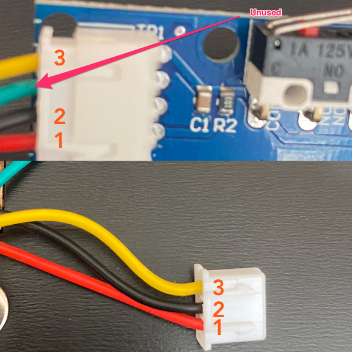
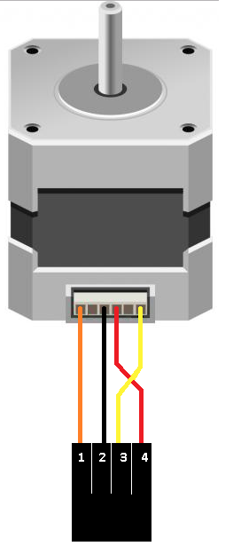

# Customized Big Tree Tech SKR v1.4 Turbo Marlin 3D Printer Firmware

This is a customized firmware build for CTC Dual with the following hardware modifications:

- Big Tree Tech SKR v1.4 Turbo control board
- Big Tree Tech 2.4" TFT Control Screen
- 5x A4988 stepper drivers
- 3x NTC 3950 100K Ohm thermistors (to replace thermocouples for hotends and bed)
- Hotend PID tune
- Bed PID tune
- Linear advance K factor tuned
- Hotend parts fan using a 5015 blower

# Why?

The Mightyboard on my printer had a component failure. Fixing it myself didn't work, replacement boards are expensive compared to RAMPS, Melzi, etc. boards, and I'm much more familiar with Marlin firmware compaired to Sailfish. Experience with 24v 

# Mightyboard Replacement Procedures

The CTC Dual/Mightyboard are 24v systems, so the SKR 1.4 board was a natural fit because it supports 24v out of the box. Also, I had recent experience with it from my previous Creality Ender 3 modifications.

## Limit Switches

The original limit switches used a four wire connection to the control board, but the SKR only supports a 3 wire connection. The wiring is documented in the [image below](images/LimitSwitchWiring.png)

## Heated Bed Wiring

Remove all but the red and black wires from the bed connector. Those two wires will go to the heated bed terminal block on the control board.

## Thermocouples

The thermocouples were replaced with standard NTC 3950 100K Ohm thermistors. Thermocouples can be reused but you will need an adapter/amplifier circuit for them to work with the SKR board. 

I carefully crimped the hotend thermistors into ring terminals and mounted them like thermocouples would be. For the heatedbed, I used kapton tape to attach the thermistor next to where the original bed temp sensor is located. 

## Steppers

The steppers need their connectors changed, to maintain the same order the pins map the following way:

## LCD and Controls

I didn't bother trying to reuse the original, I'm sure it could be possible but I wound up using the BTT 2.4" TFT control screen. There are many control screens that can be used with the SKR board, this particular one was small, cheap, and available immediately.

# Marlin 3D Printer Firmware

Additional documentation can be found at the [Marlin Home Page](http://marlinfw.org/).
Please let us know if Marlin misbehaves in any way. Volunteers are standing by!

## Marlin 2.0

Marlin 2.0 takes this popular RepRap firmware to the next level by adding support for much faster 32-bit and ARM-based boards while improving support for 8-bit AVR boards. Read about Marlin's decision to use a "Hardware Abstraction Layer" below.

Download earlier versions of Marlin on the [Releases page](https://github.com/MarlinFirmware/Marlin/releases).

## Building Marlin 2.0

To build Marlin 2.0 you'll need [Arduino IDE 1.8.8 or newer](https://www.arduino.cc/en/main/software) or [PlatformIO](http://docs.platformio.org/en/latest/ide.html#platformio-ide). Detailed build and install instructions are posted at:

- [Installing Marlin (Arduino)](http://marlinfw.org/docs/basics/install_arduino.html)
- [Installing Marlin (VSCode)](http://marlinfw.org/docs/basics/install_platformio_vscode.html).

## Marlin Support

For best results getting help with configuration and troubleshooting, please use the following resources:

- [Marlin Documentation](http://marlinfw.org) - Official Marlin documentation
- [Marlin Discord](https://discord.gg/n5NJ59y) - Discuss issues with Marlin users and developers
- Facebook Group ["Marlin Firmware"](https://www.facebook.com/groups/1049718498464482/)
- RepRap.org [Marlin Forum](http://forums.reprap.org/list.php?415)
- [Tom's 3D Forums](https://discuss.toms3d.org/)
- Facebook Group ["Marlin Firmware for 3D Printers"](https://www.facebook.com/groups/3Dtechtalk/)
- [Marlin Configuration](https://www.youtube.com/results?search_query=marlin+configuration) on YouTube

## Credits

The current Marlin dev team consists of:

- Scott Lahteine [[@thinkyhead](https://github.com/thinkyhead)] - USA &nbsp; [Donate](http://www.thinkyhead.com/donate-to-marlin) / Flattr: 
- Roxanne Neufeld [[@Roxy-3D](https://github.com/Roxy-3D)] - USA
- Chris Pepper [[@p3p](https://github.com/p3p)] - UK
- Bob Kuhn [[@Bob-the-Kuhn](https://github.com/Bob-the-Kuhn)] - USA
- João Brazio [[@jbrazio](https://github.com/jbrazio)] - Portugal
- Erik van der Zalm [[@ErikZalm](https://github.com/ErikZalm)] - Netherlands &nbsp; 

## License

Marlin is published under the [GPL license](/LICENSE) because we believe in open development. The GPL comes with both rights and obligations. Whether you use Marlin firmware as the driver for your open or closed-source product, you must keep Marlin open, and you must provide your compatible Marlin source code to end users upon request. The most straightforward way to comply with the Marlin license is to make a fork of Marlin on Github, perform your modifications, and direct users to your modified fork.

While we can't prevent the use of this code in products (3D printers, CNC, etc.) that are closed source or crippled by a patent, we would prefer that you choose another firmware or, better yet, make your own.
